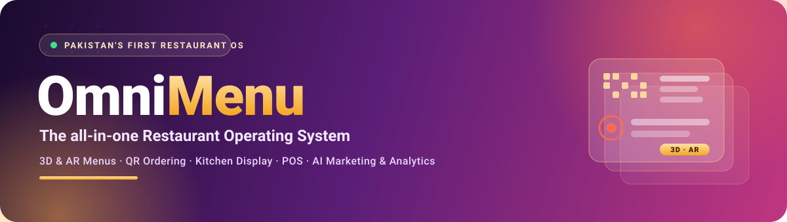

<!-- ============ BANNER ============ -->

  

<!-- ============ NAME ============ -->
<h2 align="center">Hi, I'm Asim Ibn.e Falak 👋</h2>

<!-- ============ ANIMATED HEADLINE ============ -->

  

<!-- ============ LEAD-GEN CTAs ============ -->

  
  
  

  

 

<!-- ============ ABOUT ============ -->
##  &nbsp;About me

<table>
<tr><td>

- 🏗️ &nbsp;**Founder & lead developer of [OmniMenu](https://omnimenu.one)** — Pakistan's first complete restaurant operating system.
- 💻 &nbsp;**Full-stack developer** — I architect and ship production websites in **any language, any setup**, front to back.
- 🤖 &nbsp;**AI & agents** — building autonomous **AI agents**, sharpening **prompt engineering**, and exploring applied deep AI.
- 🎯 &nbsp;I turn complex products into **clean, fast, genuinely useful** software.
- 📫 &nbsp;Reach me: **founder@omnimenu.one** &nbsp;·&nbsp; **asimfalak120@gmail.com**

</td></tr>
</table>

> **Why I build.** OmniMenu started with a simple frustration — restaurants around me still ran on paper, guesswork, and a dozen disconnected tools. I wanted to give them one platform that just *works*. That same drive shapes everything I do: take a hard problem, build something real, and make it genuinely useful for the people using it.
>
> I learn by shipping, I move fast, and I care as much about a clean interface as I do about the system behind it. Right now I'm pushing hard at the intersection of **AI and real-world products** — building agents, refining prompts, and turning ambitious ideas into things people actually rely on. If you're building something bold, I'd love to talk. 🚀

<!-- ============ FLAGSHIP ============ -->
## 🍽️ &nbsp;Flagship — OmniMenu

> **The all-in-one operating system for modern restaurants.** Everything below runs on one platform.

  

  <b>🕶️ 3D &amp; AR Menus</b> &nbsp;·&nbsp; <b>📱 QR Ordering</b> &nbsp;·&nbsp; <b>🍳 Kitchen Display</b> &nbsp;·&nbsp; <b>💳 POS</b> &nbsp;·&nbsp; <b>🤖 AI Analytics</b>

<!-- 👇 OPTIONAL: replace the line below with a real screen-recording GIF of OmniMenu for maximum impact:

-->

  

<!-- ============ TECH STACK ============ -->
## 🛠️ &nbsp;Tech stack

**Languages**

**Frontend**

**Backend**

**Databases**

**AI & Agents**

**Tools & DevOps**

<!-- ============ CURRENTLY BUILDING ============ -->
## 🚀 &nbsp;Currently building

<table>
  <tr>
    <td width="50%" valign="top">
      <h3>🍽️ Scaling OmniMenu</h3>
      Growing Pakistan's first restaurant OS — shipping 3D &amp; AR menus,
      a real-time Kitchen Display System, and AI-driven marketing &amp; analytics
      for modern restaurants.
    </td>
    <td width="50%" valign="top">
      <h3>🤖 AI agents &amp; tooling</h3>
      Building autonomous AI agents and refining prompt-engineering workflows —
      turning applied deep AI into features that ship inside real products.
    </td>
  </tr>
</table>

<!-- ============ CONNECT ============ -->
## 🤝 &nbsp;Let's connect

  
  
  
  <!-- Optional — add your LinkedIn, then delete this comment:
  
  -->

<!-- ============ GITHUB STATS ============ -->
## 📊 &nbsp;GitHub stats

  
  &nbsp;
  

  

<!-- ============ CONTRIBUTION ACTIVITY GRAPH ============ -->
## 📈 &nbsp;Contribution activity

  

<!-- ============ SNAKE (live motion — needs the GitHub Action, see setup) ============ -->

  

<!-- ============ FOOTER ============ -->
 

  

  

